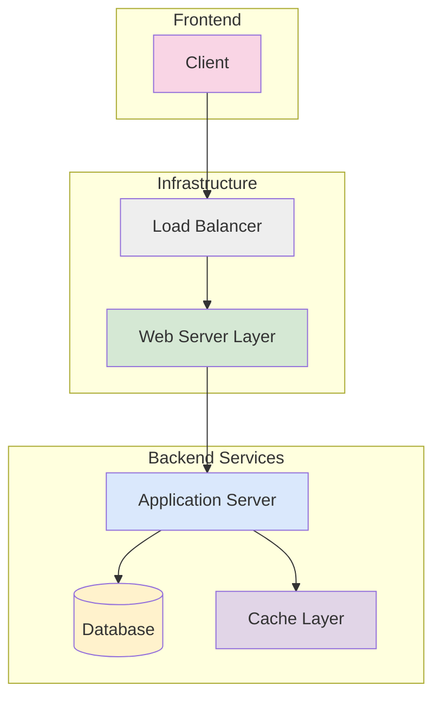

# Architecture Overview

This document provides a high-level architecture overview using a Mermaid diagram.

## System Architecture

## Components Description

1. **Client**: End-user interface (web/mobile applications)
2. **Load Balancer**: Distributes incoming traffic
3. **Web Server Layer**: Handles HTTP requests and static content
4. **Application Server**: Core business logic processing
5. **Database**: Persistent data storage
6. **Cache Layer**: Performance optimization layer